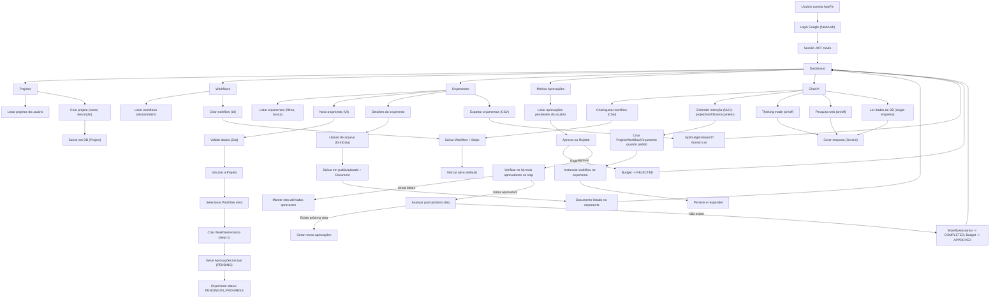

# AppFin — Manual de Apresentação e Uso Rápido

Esta apresentação guia sua equipe a usar o AppFin do login à aprovação final, com exemplos práticos e atalhos. Onde indicado, insira capturas de tela da sua instância (sugestões de imagens marcadas como [INSERIR CAPTURA]).

## 1) Agenda
- Visão geral e objetivos
- Acesso e navegação
- Projetos
- Workflows (UI e Chat IA)
- Orçamentos (UI e Chat IA)
- Aprovações (Minhas Aprovações)
- Documentos (upload)
- Exportação
- Chat IA — Thinking mode e Pesquisa Web
- Fluxograma operacional (referência)
- FAQ e dicas

---

## 2) Objetivo da Plataforma
- **Gestão Financeira com IA**: centraliza projetos, orçamentos e aprovações.
- **Esteira de Aprovação**: workflows configuráveis, aprovação multi-etapas.
- **Chat Inteligente**: cria projetos, workflows e orçamentos em linguagem natural.

---

## 3) Acesso e Navegação
- URL local: `http://localhost:3000`
- Login: **Google OAuth**
- Após login: **Dashboard** com cartões para Projetos, Orçamentos, Workflows, Aprovações e Chat IA.

[INSERIR CAPTURA] Tela de login (Google)

[INSERIR CAPTURA] Dashboard com cartões

Atalhos rápidos:
- Projetos: `/projects`
- Orçamentos: `/budgets`
- Workflows: `/workflows`
- Minhas Aprovações: `/approvals`
- Chat IA: `/chat`

---

## 4) Projetos
- Lista de projetos do usuário.
- Criar projeto: botão “Novo Projeto”, preencha nome e (opcional) descrição.
- Cada orçamento pertence a um projeto.

[INSERIR CAPTURA] Lista de projetos

---

## 5) Workflows (UI e Chat)
### 5.1 Pela UI
- Acesse `/workflows` → “Criar Workflow”.
- Monte as etapas (START → APPROVER/CONDITION/ACTION → END).
- Salve e **marque como ativo** para uso nos novos orçamentos.

[INSERIR CAPTURA] Builder de Workflow

### 5.2 Pelo Chat (linguagem natural)
- Abra `/chat` e peça, por exemplo:
  - “Gostaria de um workflow chamado Compras Padrão.”
  - Resultado: um fluxo mínimo é criado (START → APPROVER → END) e ativado.
- Ajuste com novas frases conforme a sua necessidade.

---

## 6) Orçamentos
### 6.1 Pela UI
- Acesse `/budgets` → “Novo Orçamento”.
- Preencha projeto, nome, valor e (opcional) descrição.
- O sistema seleciona o **último workflow ativo** e cria a instância (primeiro step).
- A listagem oferece **filtros** por status e **busca** por nome/projeto.

[INSERIR CAPTURA] Lista de orçamentos com filtros e busca

### 6.2 Pelo Chat (linguagem natural)
- Exemplos úteis:
  - “Preciso de um orçamento de R$ 12.500 para o projeto Marketing 2025, compra de mídia.”
- O Chat cria o orçamento, vincula ao projeto (cria se não existir) e inicia a esteira.

---

## 7) Aprovações — Minhas Aprovações
- Acesse `/approvals` para ver tudo que você precisa decidir.
- Clique em **Aprovar** ou **Rejeitar**.
- Regras:
  - Ao **rejeitar**: orçamento vira REJECTED.
  - Ao **aprovar**: avança no step atual; se acabar, o orçamento vira APPROVED.

[INSERIR CAPTURA] Tela de “Minhas Aprovações”

---

## 8) Documentos (Upload)
- Acesse um orçamento em `/budgets/:id`.
- Seção **Documentos**: clique em “Anexar documento” e selecione o arquivo.
- O arquivo é salvo em `public/uploads` e vinculado ao orçamento.
- É possível visualizar o documento pelo link na lista.

[INSERIR CAPTURA] Upload e listagem de documentos no detalhe do orçamento

---

## 9) Exportação
- Exporte orçamentos em CSV:
  - `GET /api/budgets/export?format=csv`
- Útil para planilhas, BI e auditoria.

---

## 10) Chat IA — Thinking Mode e Pesquisa Web
- Vá para `/chat`.
- **Thinking Mode**: liga/desliga para raciocínio aprofundado.
- **Pesquisa Web**: liga/desliga para permitir grounding externo quando necessário.
- Sugestões:
  - “Por favor, crie um projeto tal…”
  - “Quero um orçamento para…”
  - “Monte um workflow com gerente, depois diretor… até R$ 200 mil”

[INSERIR CAPTURA] Chat IA com toggles ativos

---

## 11) Fluxograma Operacional (referência)

---

## 12) FAQ e Dicas
- “Como defino quem aprova?”
  - No workflow: etapas do tipo APPROVER com o usuário responsável.
- “Orçamento não avançou de etapa, e agora?”
  - Verifique se **todas as aprovações do step atual** foram concluídas.
- “Quero criar tudo por Chat.”
  - Use o Chat com frases naturais; os toggles (Thinking/Web) ajudam a enriquecer respostas.
- “Exportar para planilha?”
  - Baixe o CSV em `/api/budgets/export?format=csv` e abra no Excel/Google Sheets.

---

## 13) Sugestões de Capturas (para completar depois)
- `docs/img/login.png` — Login Google
- `docs/img/dashboard.png` — Dashboard com cartões
- `docs/img/projects.png` — Lista de projetos
- `docs/img/workflows.png` — Builder de workflows
- `docs/img/budgets-list.png` — Orçamentos com filtros e busca
- `docs/img/budget-details.png` — Detalhe com documentos
- `docs/img/approvals.png` — Minhas Aprovações
- `docs/img/chat.png` — Chat com toggles e exemplo de criação por fala natural

---

Pronto! Este material pode ser apresentado em reunião, enviado para clientes e usado como guia rápido do time.
